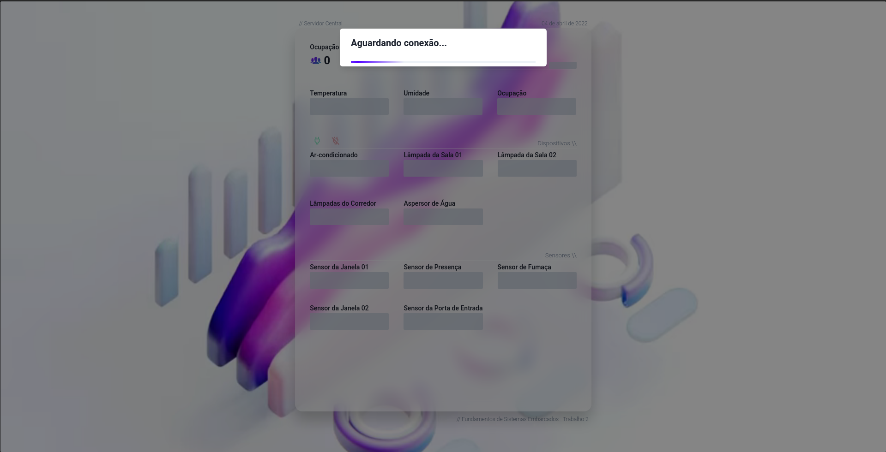

# FSE-Trabalho-2

Trabalho 2 da disciplina de Fundamentos de Sistemas Embarcados (2021/2)

<p align="center">
  
</p>

## Objetivo

Este trabalho tem por objetivo a criação de um sistema distribuído de automação predial para monitoramento e acionamento de sensores e dispositivos de um prédio de 2 andares.

## Execução

Para executar o projeto com o **Servidor Central** rodando **localmante** (caso o docker não rode na rasp 43)

#### Execute os seguintes comandos:

#### 1. Inicie o Servidor Central localmente

Com yarn

```
yarn install
yarn dev
```

ou Com docker

```
docker build -t nextjs-docker .
docker run -v `pwd`:/www/static -p 3000:3000 -p 10049:10049 nextjs-docker
```

Navegue para Servidor Central que estará rodando em `localhost:3000`

#### 2. Abra um tunel ssh

Para que os Servidores Distribuidos possam se comunicar da rasp42 com o Central rodando na sua maquina, execute-os através de um tunel ssh.

Entre na rasp42 atrevés do tunel

```
ssh -R 10049:localhost:10049 < rasp42 >
```

#### 3. Compile o servidor distribuido na rasp 42

```
make
```

#### 4. Execute

Para servidor do terreo:

```
make terreo_local
```

Para servidor 1oAndar:

```
make primeiro_local
```

---

Para executar o projeto na rasp execute os seguintes comandos:

#### 1. Inicie o Servidor Central

Com docker

```
docker build -t nextjs-docker .
docker run -v `pwd`:/www/static -p 3000:3000 -p 10049:10049 nextjs-docker
```

ou

```
yarn build
yarn start
```

Abra o Servidor Central no navegador

#### 2. Compile o servidor distribuido

```
make
```

#### 3. Execute

Para servidor do terreo:

```
make terreo
```

Para servidor do 1oAndar:

```
make primeiro
```

## Como usar

##

<p align="center">
  
</p>

<p align="center">
  
</p>
